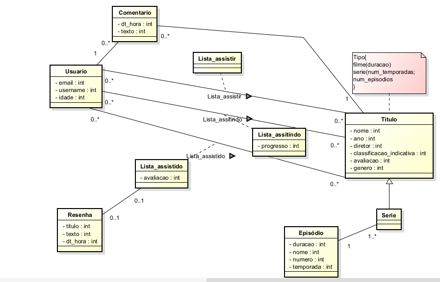

# **Modelo Conceitual** <h1>

### Usuário <h3>
> O Usuário é uma pessoa - independente de física ou jurídica - que tem instancias correspondentes a seu email, nome de usuário - username - e idade. Ele atua no sistema criando comentários privados, criando resenhas públicas, marcando progresso de acompanhamento do título - status: assistido, assistindo, não assistido -.

### Título <h3>
> O Título se refere as obras audiovisuais filme, séries e novelas que podem estar cadastrados no Sistema de Lista de Filmes e Séries Nacionais. 
> - No geral, ele tem os atributos Nome -titulo da obra-, ano -de lançamento-, diretor, classificação indicativa, avaliação e gêneros.
> - Se for série ou novela, além dos gerais ele vai quantidade de temporadas/capitulos e de episódios. Os episódios teram duração, nome e número - endereço dentro da temporada -.
> - Se for filme, além dos gerais ele vai ter uma duração.

### Listas <h3>
> A partir do progresso do Usuário, a relação dele com o Título se modifica, podendo estar assistido, assistindo ou quero assistir - vi, vendo ou quero ver -. No Assistido pode ser adicionado as resenhas e avaliações, no assistindo pode ser adicionado apenas os comentários privados e a atualização de progresso enquanto no título marcado como quero assistir essas ações não são permitidas, com propósito somente organizacional. Um título só pode se relacionar com um usuário de 1 das 3 formas, mas as listas podem estar vazias, assim como pode haver títulos não descritos nos 3 relacionamentos, mas que ainda podem ser vizualidaos pelo usuário

### Resenha <h3>
> Tem título, para situar os leitores do assunto, e o encorpo, que é a própria resenha. Ela é adicionada a apenas um título e precisa estar relacionada ao seu autor - o usuário -. Uma resenha precisa de avaliação, mas nem toda avaliação carece de uma resenha, embora para ambos seja necessário que o título esteja marcado como Assistido.

### Comentário <h3>
> Possui texto, que é o prórpio comentário, e a data e a hora que foi publicado. Mais de um comentário pode ser adicionado à um título por um usuário, mas o usuário visualiza somente seus próprios comentários. É adicionado somente a um título marcado como Assistido, ou Assistindo pelo seu autor - o usuário -.

